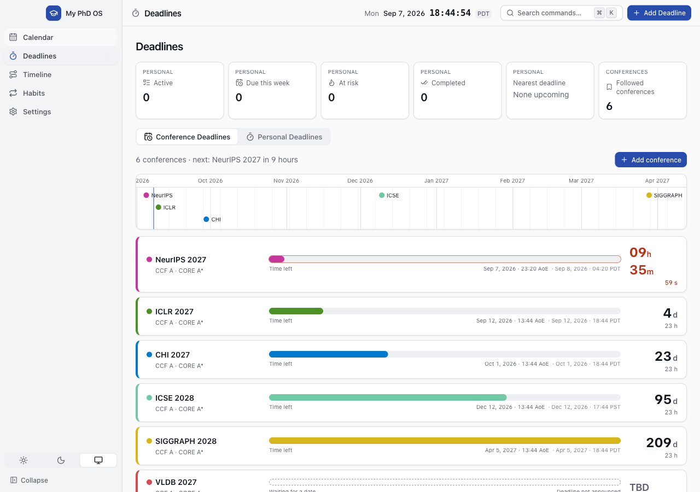

# My PhD OS

A desktop app for a PhD student's calendar, deadlines, milestones and habits. Everything is stored
on your own machine in one file. No accounts, no cloud, no sync, no AI.



## Install (macOS)

**[Download the latest release](https://github.com/Alessange/my-phd-os/releases/latest)** and drag
**My PhD OS** into Applications. Universal, so it runs on Apple Silicon and Intel.

The first launch is blocked with _"Apple could not verify … is free of malware"_. That only means
the app has no paid Apple signature. To allow it, open **System Settings › Privacy & Security** and
click **Open Anyway**.

To upgrade, quit the app and replace it. Your data lives outside the app, so nothing is lost.

Windows and Linux builds are configured but have never been built or tested.

## What's in it

- **Calendar** — month, week, day and list views, per-event timezones, repeating events, `.ics`
  import and export.
- **Deadlines** — the conferences you follow, each a coloured bar with a countdown, plus your own
  deadlines with separate time and work progress.
- **Timeline** — milestones as bars across a semester, a year or the whole programme.
- **Habits** — daily and weekly tracking with streaks.
- **Settings** — formats, conference sources, and JSON backup and restore.

Press `⌘K` for the command palette, `⌘N` to create something, `⌘1`–`⌘5` to switch pages.

## Conferences

The Deadlines page shows only the conferences you pick. **Add conference** searches the public CCF
Deadlines list, which loads on first use; nothing appears until you add it. The list refreshes in
the background and is cached, so the app works offline. Deadlines come from the feed and cannot be
edited: a round the feed drops shows as **TBD** rather than a guessed date.

## Your data

Everything lives in `~/Library/Application Support/my-phd-os/` (`%APPDATA%\my-phd-os\` on Windows,
`~/.config/my-phd-os/` on Linux). The only network requests the app ever makes are to fetch the
conference feeds you added.

> **Back up now and then.** That folder is the only copy. Use **Settings › Data › Export backup**.
> Deleting it, or uninstalling with a cleaning tool, erases everything with no undo.

## Development

Needs Node 24+ and npm 10+. Nothing else.

```sh
npm install
npm run dev          # run with hot reload
npm test             # unit and integration tests
npm run lint         # lint and formatting
npm run typecheck    # types
npm run build        # build into out/
npm run test:e2e     # end-to-end tests, after a build
npm run build:mac    # disk image into release/
```

Built with Electron, React, TypeScript, Tailwind, FullCalendar, Luxon and `node:sqlite`.

`src/main` is the Electron process (database, files, conference fetching), `src/preload` the bridge,
`src/renderer` the interface, `src/shared` the logic both sides use.

If you run Electron by hand, prefix it with `env -u ELECTRON_RUN_AS_NODE`, or it exits immediately.

## Known limitations

Only tested on macOS, and unsigned. Repeating events are edited as a whole series. There are no
notifications, automatic updates or sync.

## More

[Architecture and decisions](docs/ARCHITECTURE.md) · [API notes](docs/FOUNDATION_API.md) ·
[CCF feed format](docs/upstream-ccf-feed.md) · [Delivery report](docs/DELIVERY_REPORT.md)
([中文](docs/DELIVERY_REPORT.zh-CN.md)) · [Original spec](prompt.md)
